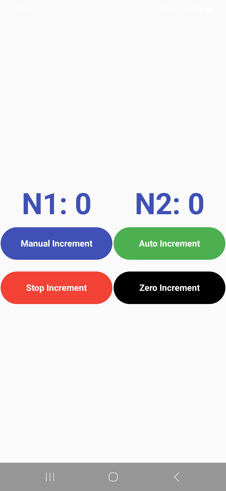

# 📈 Incrementador

Um aplicativo Android desenvolvido com **Jetpack Compose**, que apresenta dois valores (`n1` e `n2`) e permite incrementos manuais e automáticos, além de ações como parar e zerar os contadores. O projeto segue uma arquitetura baseada em **Componentes + Hooks personalizados**, inspirada no estilo React.

---

## 🚀 Funcionalidades

- ✅ Incremento manual de `n1` com atraso de 1 segundo
- 🔁 Incremento automático de `n1` a cada segundo
- ⏹️ Interrupção da contagem automática
- 🔄 Zerar valores de `n1` e `n2`
- ✨ Animações suaves de feedback nos botões
- 🧩 Interface 100% declarativa com Compose

---

## 🧱 Arquitetura

- **Jetpack Compose** como base da UI
- **Hooks personalizados** para encapsular lógica de estado (sem ViewModel)
- **Componentização** de botões e display
- **Tema próprio (`IncrementadorTheme`)**
- Gerenciamento de **ciclo de vida** com `DisposableEffect` e `LifecycleObserver`

> Inspirado na arquitetura do React (com `useState`, `useEffect`, e `custom hooks`).

---

## 📁 Estrutura do Projeto

com.newoverride.incrementador/ ├── HomeActivity.kt # Tela principal ├── hooks/ │ └── incrementHook.kt # Lógica de estado (sem ViewModel) ├── model/ │ └── IncrementModel.kt # Modelo com estados e ações ├── ui/ │ ├── components/ # Botões e display │ ├── theme/ # Cores e estilos │ └── view/ │ └── HomeView.kt # Composable principal ├── dimens/ │ └── Dimens.kt # Dimensões reutilizáveis


---

## 📸 Demonstração



---

## 🛠️ Tecnologias Usadas

- [Kotlin](https://kotlinlang.org/)
- [Jetpack Compose](https://developer.android.com/jetpack/compose)
- [Kotlin Coroutines](https://kotlinlang.org/docs/coroutines-overview.html)
- [Material 3](https://m3.material.io/)
- Arquitetura inspirada em React com hooks

---

## 🧪 Como Rodar

1. Clone o repositório:
   ```bash
   git clone https://github.com/MaiconMJS/incrementador-android.git